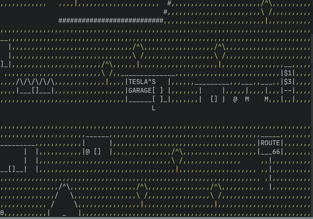

# cursesProject a.k.a. "SpankWagon"

Spankwagon is an ASCII art RPG played in the terminal, which I made as a final project for an introductory C course in my freshman year of college.

The name was bequeathed by my friend who also did all of the map making and wrote the [story](doc/SpankWagonStory.txt). In a bit of a dare, I told her I would name it whatever she went with first, and she decided upon something that was vagugely, but not outright, euphemistic just to make me regret that promise. The story follows a recently concussed Amazon warehouse worker named Chad and his exploits involving Nikola Tesla, Ronald Regan, time travel, and references to several highly copyrigted pieces of media.

For the final project of an introductory course I actually got quite a bit working, including a menu system, transition between different maps, character level, health, and random encounters. I even made a separate utility to make the maps in, which is what my friend used. That being said, the random encounters/battles aren't fully implemented (there is only one enemy, you can only select one combat option, leveling up just restores your health), and there's no cutscenes or dialogue. Still, it can be fun to just walk around in the maps my friend was kind enough to make (with random encounters disabled, they get annoying).

This particlar game uses the pdcurses library to implement curses.h on Windows, and ncurses for Linux.
## Installation
Clone the repository, then:

### Unix
Install the ncurses library (`sudo apt-get install ncurses-dev` on Ubuntu).
Run `make unix`. The compiled program can be run by the command `./SpankWagon`

### Windows
The hard way is to compile it yourself. I compiled it using MinGW gcc. You also need to install the pdcurses library using the MinGW package installer. Then run `make` on the command line.

## Gallery
Chicago, 1909

Corn, of the Children. Definitely not the other way around

Colorado Springs

Nikola Tesla's pad

The National Mall

Portland

Area 51

## Credits
I did all of the coding, but credits go to my friend Mel for the name, level design, and story for the game, without which, it would be just an incomplete ncurses RPG framework.
